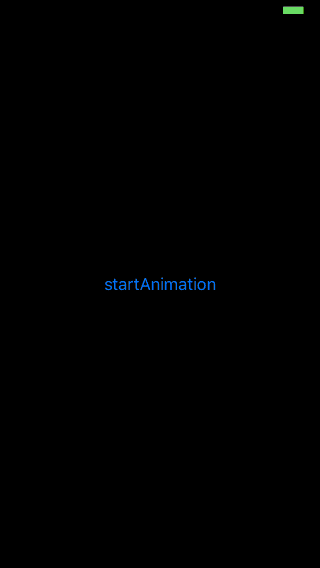

# MSNumberScrollAnimatedView

使用 MSNumberScrollAnimatedView 来显示数字时，可以添加数字滚动效果。

**这个项目是在 [JTNumberScrollAnimatedView](https://github.com/jonathantribouharet/JTNumberScrollAnimatedView) 的基础上修改的，感谢[原作](https://github.com/jonathantribouharet)。**

## 主要修改了这几点
1. 去掉 startAnimation 方法中调用 prepareAnimations 方法，这个方法的作用是准备好滚动的内容，在 setNumber 方法里已经调用了。

2. createAnimations 方法里的 duration 计算错误，应该减去 [numbersText coun] - 1个 durationOffset , 因为durationOffset是相对上一个layer动画结束的间隔，当有n个layer 的时候，有n-1个间隔。

3. 数字的排序是降序排序，isAscending 属性表示滚动的方向，默认为NO，向下滚动。

4. 增加了 reloadView 方法 ，满足 setNumber 之后，还可以修改一些样式属性的需求 

## 演示



## 系统要求

* `iOS7` 及以上。
* Automatic Reference Counting(ARC)

## 安装

#### CocoaPods
1. 在 Podfile 中添加 `pod 'MSNumberScrollAnimatedView'`。
2. 执行 `pod install` 或 `pod update`。
3. 导入头文件：`#import <MSNumberScrollAnimatedView.h>`。

#### 手动安装
1. 下载 MSNumberScrollAnimatedView 项目。
2. 将 `MSNumberScrollAnimatedView` 文件夹中的源文件拽入项目中。
3. 导入头文件：`#import "MSNumberScrollAnimatedView.h"`。

## 使用

你可以像使用普通视图一样来使用 `MSNumberScrollAnimatedView`

#### 可以在xib中加载

```object-c	
@property (nonatomic, weak) IBOutlet MSNumberScrollAnimatedView *numberAnimatedV;
```

#### 也可以使用代码来创建

```object-c	
MSNumberScrollAnimatedView *numberAnimatedV = [[MSNumberScrollAnimatedView alloc] initWithFrame:CGRectMake(0, 0, 320, 80)];
```

#### 提供这些属性来对动画进行定制

```object-c
// 样式相关
@property (nonatomic, strong) UIColor *textColor;
@property (nonatomic, strong) UIFont *font;
@property (nonatomic, assign) NSUInteger density;               // 滚动数字的密度
@property (nonatomic, assign) NSUInteger minLength;             // 最小显示长度，不够补零
// 动画相关
@property (nonatomic, assign) NSTimeInterval duration;          // 动画总持续时间
@property (nonatomic, assign) NSTimeInterval durationOffset;    // 相邻两个数字动画持续时间间隔
@property (nonatomic, assign) BOOL isAscending;                 // 方向，默认为NO，向上
```

#### 设置数字(最好是配置完样式属性后再 setNumber )

```object-c
self.numberAnimatedV.textColor = [UIColor redColor];
self.numberAnimatedV.font = [UIFont fontWithName:@"HelveticaNeue-Bold" size:42];
[self.numberAnimatedV setNumber:@1234];
```

#### 播放动画（ setNumber 之后，播放动画才会有效 ）

```object-c
[self.numberAnimatedV setNumber:@1234];
[self.numberAnimatedV startAnimation];
```

#### 刷新视图样式（如果在 setNumber 之后，修改了样式属性，需要刷新视图才生效）

```object-c
[self.numberAnimatedV setNumber:@1234];
self.numberAnimatedV.textColor = [UIColor redColor];
[self.numberAnimatedV reloadView];
```

## 许可证

MSNumberScrollAnimatedView 使用 MIT 许可证，详情见 LICENSE 文件。

***

## 原理
把数拆开，每个数字对应一个滑动视图，在滑动视图上面添加不同的数字，通过滑动滑动视图来实现数字滚动的效果，然后针对每个滑动视图设置不同的动画持续时间来实现数字滚动的视觉差。

## 项目实现的一些细节
1. configNumbersText 中第一个 for循环 需要强制转化为NSInteger，因为 minLength 和 length 都是 NSUInteger 类型（无符号整型），如果相减得负数的话比较会有问题，因为忽略了符号所以会得到一个很大的正整数。

2. 为什么使用 CAScrollLayer 不使用 UIScrollerView ？
因为 CAScrollLayer 提供了和 UIScrollView 的基本功能。只不过它是layer，只负责显示，不响应用户事件。项目中不需要响应用户事件，对 layer 做动画也比较灵活，所以使用 CAScrollLayer。

3. 为什么使用 UILabel 不使用 CATextLayer ？
因为数字是 垂直和水平居中的，UILabel 本身就是垂直居中，CATextLayer 本事是不支持垂直居中的，如果要实现这中效果，就必须作些额外的操作。

4. 在 createAnimations方法中 keyPath 使用 sublayerTransform 不使用 transform，因为动画是应用在 CAScrollLayer 的子图层，而不是它本身。

5. reloadView 的思想参考了 UITableView 的 reloadData 方法，如果旧数据已经显示，有新数据的时候，需要 reloadData 才会显示新数据。 

6. 在 ARC 下，需要使用 _scrollLabels 数组来保存 label ，防止被回收，如果 label 被回收了，就算它的 layer 没有被回收，也会出现问题（不显示文字，没有颜色等）。 